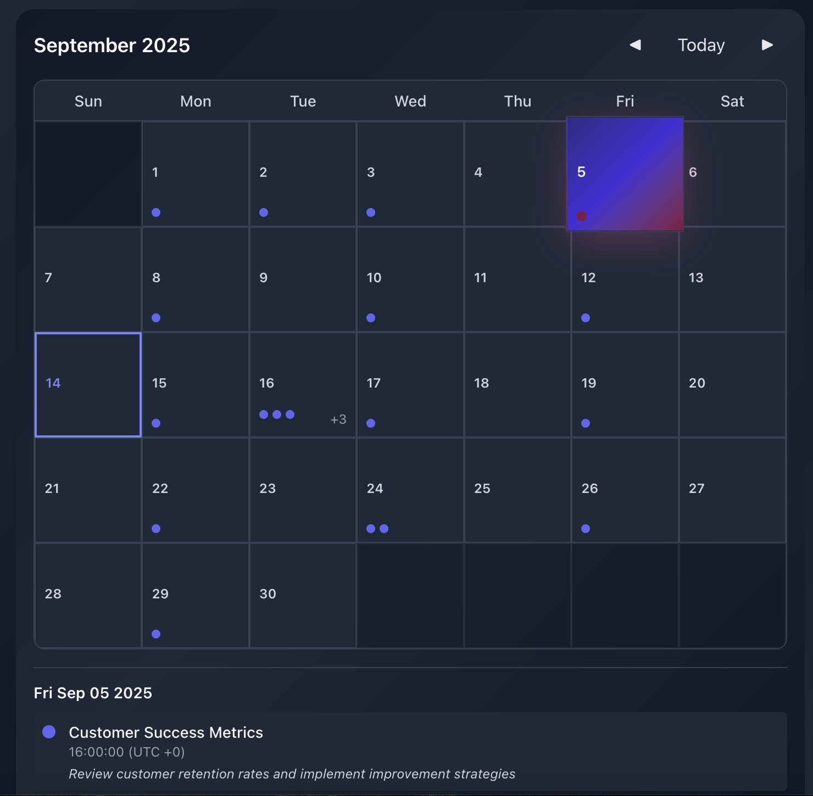
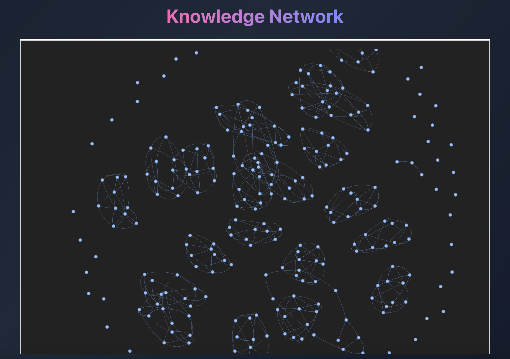

# BrainBox

*Reimagining Dropbox for the AI era*

HackMIT 2025 Submission
Team: Chris Yoo, Eric Yee, Jonas Sun, Rohan Dhillon

BrainBox is an agentic database for enterprise knowledge. It's not just a medium of file storage - it's an agentic archivalist that listens, acts, and visualizes the vast amount of knowledge that go undocumented and lost within an organization.

BrainBox connects to the platforms employees use every day - Slack, Zoom, Notion - and autonomously pulls insights, blockers, milestones etc. into its knowledge base. Whether you're the founder of a 500-person company who wants a bottom-up view of their organization, or a scale-up scrambling to capture the growing collective knowledge of your team, BrainBox is an effortless way to store, visualize and interact with your enterprise data.

[Pitch deck](https://docs.google.com/presentation/d/1mbYwwYdq3Ohgsw2uWBAi5KfMlRb1liGQmNu1p3D-VZQ/edit?usp=sharing)

